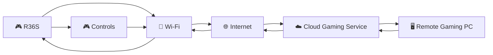
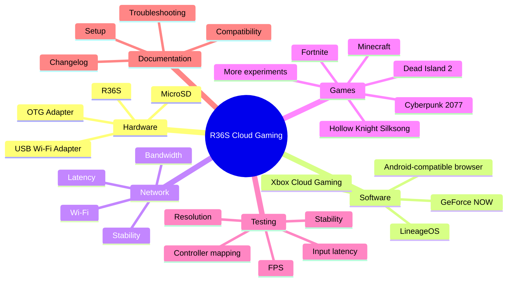
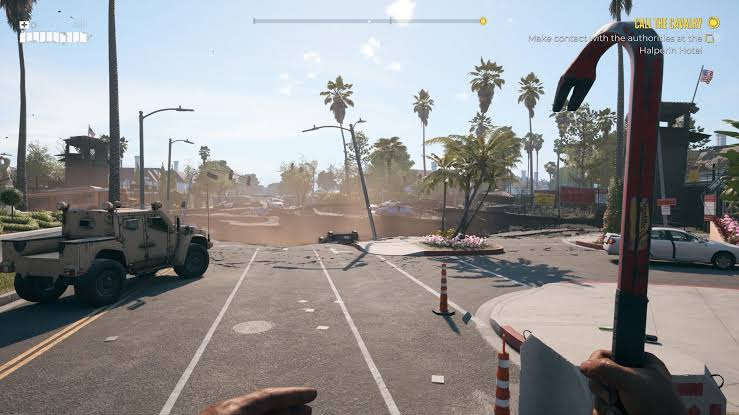
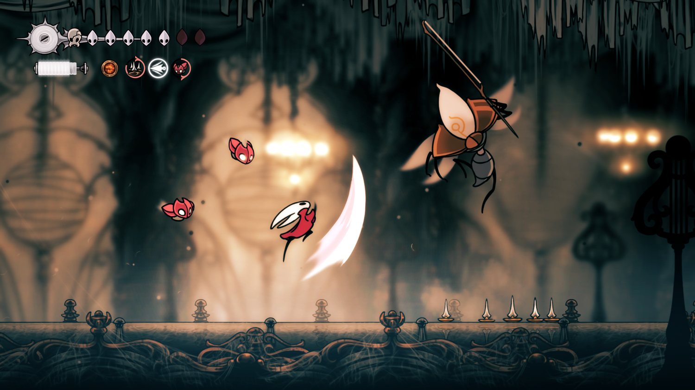
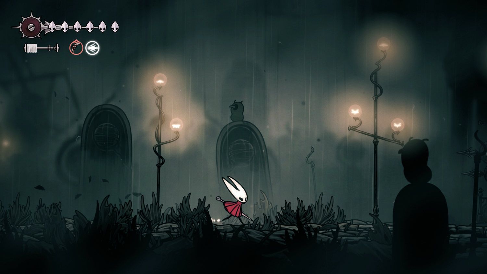

<a id="readme-top"></a>

<div align="center">

  

  # R36S Cloud Gaming

  **Turn the tiny R36S into a pocket-sized cloud gaming client.**

  Stream modern games to a low-cost retro handheld and take your gaming library almost anywhere — without needing a powerful PC inside the console.

  <p>
    <a href="#-features">Features</a> •
    <a href="#-how-it-works">How it works</a> •
    <a href="#-setup">Setup</a> •
    <a href="#-game-ideas">Game ideas</a> •
    <a href="#-roadmap">Roadmap</a>
  </p>

  <p>
    
    
    
  </p>

</div>

---

## What is R36S Cloud Gaming?

The **R36S** is an inexpensive handheld designed primarily for retro gaming. That's great… until you've played your entire library and start wishing you could carry newer games with you.

This project explores a simple idea:

> **What if the R36S could become a portable screen + controller for modern cloud gaming?**

Instead of rendering the game locally, a cloud gaming service does the heavy work on a remote computer. The R36S receives the video stream and sends your controls back over the network.

That means a small handheld can potentially access games that would be far beyond its local hardware capabilities.

### Project goals

- Play modern games on a tiny retro handheld.
- Experiment with **Xbox Cloud Gaming** and **GeForce NOW**.
- Make the setup as portable as possible.
- Explore cloud gaming as a cheaper alternative to buying a powerful gaming PC or handheld.
- Document what actually works instead of promising that every game will run.
- Build a repeatable setup that other R36S owners can experiment with.

> **Important:** Cloud gaming performance depends heavily on your Wi-Fi connection, latency, browser/OS compatibility, controller mapping, and the cloud service itself.

---

## Features

| Feature | Status |
|---|:---:|
| R36S cloud-gaming concept | ✅ |
| Xbox Cloud Gaming experiments | 🧪 |
| GeForce NOW experiments | 🧪 |
| Game compatibility list | 🧪 |
| Setup documentation | 🧪 |
| Performance testing | 🚧 |
| Wi-Fi adapter testing | 🚧 |
| Controller/input optimization | 🚧 |
| Multi-language documentation | 🚧 |

---

## How it works



### The basic idea

**1. You press a button on the R36S**  
⬇️  
**2. The input travels through Wi-Fi**  
⬇️  
**3. A remote gaming machine processes the input**  
⬇️  
**4. The game renders remotely**  
⬇️  
**5. The video/audio stream is sent back to the R36S**  
⬇️  
**6. You see and control the game on the handheld**

The R36S doesn't need to render the game itself. That's the whole trick.

---

## Project mind map



---

#  Game ideas

The following are **cloud-gaming candidates/examples**, not a guarantee that every title is currently available on every service.

### Dead Island 2

<a href="https://store.epicgames.com/p/dead-island-2?lang=en-US">
  
</a>



A perfect example of the project's purpose: a game that is far too demanding for the R36S's normal hardware, but could potentially be streamed from a more powerful machine.

**Status:** TESTED! (8/10)

---

### Hollow Knight: Silksong

<a href="https://hollowknightsilksong.com/">
  
</a>



A much lighter game than Dead Island 2, making it an interesting candidate for testing latency, controls, and image quality.

**Status:** TESTED! (10/10)

---

###  Fortnite

A useful candidate for testing fast movement, camera control, and input latency.

**Why test it?**

- Fast-paced gameplay
- Requires responsive controls
- Great for detecting input delay
- Popular cloud-gaming use case

**Status:** Candidate

---

### Cyberpunk 2077

One of the ultimate stress tests for the concept.

The R36S cannot realistically render the game locally, but cloud streaming moves the rendering workload to a remote gaming PC.

**Status:** Candidate

---

###  Minecraft

Minecraft can be interesting for testing both controller compatibility and longer play sessions.

**Status:** Candidate

---

### More games worth experimenting with

- **DOOM Eternal**
- **Forza Horizon 5**
- **The Witcher 3**
- **Red Dead Redemption 2**
- **Apex Legends**
- **Fall Guys**
- **Sea of Thieves**
- **Grounded**
- **Palworld**
- **Control**
- **No Man's Sky**
- **Elden Ring**

> Availability changes between cloud services, regions, subscriptions, and publishers. Treat this list as a testing wishlist rather than a compatibility guarantee.

---

# What you need

### Hardware

-  **R36S handheld**
-  **USB-C OTG adapter**
-  **USB Wi-Fi adapter compatible with your OS**
-  MicroSD card
-  Charged handheld

### Software

Depending on the approach you use:

- A compatible Android/Linux-based OS
- A compatible web browser
- Xbox Cloud Gaming and/or GeForce NOW account
- Your game/service subscription where required

---

#  Setup

> ⚠️ **Experimental project:** the exact steps can vary depending on your R36S revision, operating system, Wi-Fi adapter, and browser.

## 1. Prepare the R36S

Make sure the handheld is working normally before modifying anything.

**Back up your important SD-card data first.**

---

## 2. Get network access

The R36S normally needs an external Wi-Fi solution for this type of experiment.

A typical setup is:

```text
R36S
  │
  ▼
USB-C OTG Adapter
  │
  ▼
USB Wi-Fi Adapter
  │
  ▼
 Wi-Fi Router
  │
  ▼
 Internet
```

Use hardware that is actually supported by the operating system you choose.

---

## 3. Install a compatible OS/browser

The original project explored **LineageOS + a web browser** as one possible route.

The important requirement is not the name of the OS itself — it is whether your chosen OS can:

- connect to Wi-Fi,
- run a compatible browser,
- recognize your controls,
- and handle the cloud-gaming web application.

**Do not install random APKs or images from untrusted sources.**

---

## 4. Connect to cloud gaming

Once networking and browser support are working:

1. Connect to a stable Wi-Fi network.
2. Open the supported cloud-gaming website.
3. Sign in.
4. Test a lightweight game first.
5. Check controller input.
6. Gradually move to more demanding/latency-sensitive games.

---

#  Testing checklist

When a game is tested, record more than just "it works."

| Test | What to record |
|---|---|
|  Controls | Buttons, sticks, triggers |
|  Wi-Fi | Connection quality |
|  Latency | Noticeable input delay |
|  Image | Resolution / compression |
|  Audio | Stuttering / delay |
|  Battery | Approx. play time |
|  Heat | Temperature / comfort |
|  Stability | Crashes / disconnects |
|  Overall | Playability rating |

### Suggested rating

**🟢 Excellent** — feels close to local gaming  
**🟡 Playable** — noticeable compromises  
**🟠 Experimental** — works, but has major issues  
**🔴 Not playable** — unusable for normal gameplay

---

#  Compatibility matrix

This section can grow as real tests are performed.

| Game | Service | Controls | Streaming | Overall |
|---|---|:---:|:---:|:---:|
| Dead Island 2 | Xbox Cloud / GeForce NOW | 🧪 | 🧪 | 🧪 |
| Hollow Knight: Silksong | Cloud service dependent | 🧪 | 🧪 | 🧪 |
| Fortnite | Cloud service dependent | 🔎 | 🔎 | 🔎 |
| Cyberpunk 2077 | GeForce NOW / other supported services | 🔎 | 🔎 | 🔎 |
| Minecraft | Cloud service dependent | 🔎 | 🔎 | 🔎 |
| DOOM Eternal | Cloud service dependent | 🔎 | 🔎 | 🔎 |
| Forza Horizon 5 | Xbox Cloud / supported services | 🔎 | 🔎 | 🔎 |
| Red Dead Redemption 2 | Supported cloud services | 🔎 | 🔎 | 🔎 |

**Legend:**  
🧪 = needs real testing · 🔎 = candidate / research · ✅ = confirmed working · ❌ = not working

---

# Tips for better cloud gaming

### Use the best Wi-Fi you can

Cloud gaming is much more sensitive to network quality than ordinary web browsing.

Whenever possible:

- Stay close to the router.
- Prefer a stable 5 GHz network when supported.
- Avoid congested networks.
- Avoid large downloads while gaming.
- Test latency, not only download speed.

###  Start with slower games

Before testing competitive shooters, try:

- platformers,
- RPGs,
- turn-based games,
- exploration games.

This makes it easier to determine whether the problem is the network, browser, controls, or game itself.

###  Don't chase maximum resolution

A stable lower-resolution stream can feel much better than a high-quality stream with constant buffering.

**Stability > resolution.**

---

#  Troubleshooting

## "The R36S has no internet"

Check:

- Is the Wi-Fi adapter recognized?
- Is the OTG adapter connected correctly?
- Does the OS support that Wi-Fi chipset?
- Is the Wi-Fi network visible?
- Does another device connect to the same network?

---

## "The browser doesn't work"

The browser must support the web technologies used by the cloud service.

If one browser fails:

1. Check whether another compatible browser is available.
2. Check the OS architecture/version.
3. Check whether the service officially supports that browser.
4. Avoid downloading unknown APKs from random websites.

---

## "The controls don't work"

Possible causes include:

- browser gamepad compatibility,
- incorrect controller mapping,
- OS-level input mapping,
- cloud service limitations,
- unsupported buttons/triggers.

Test each button individually before launching a demanding game.

---

## "It has huge input delay"

Try:

1. Move closer to the router.
2. Use a less congested Wi-Fi network.
3. Lower the streaming quality.
4. Close other network-heavy applications.
5. Test another game/server.
6. Compare different times of day.

If latency remains high, the issue may be the network route or cloud server rather than the R36S itself.

---

#  Recommended project structure

```text
R36S-Cloud-Gaming/
│
├── README.md
├── CHANGELOG.md
├── LICENSE.txt
│
└── images/
    ├── logo.png
    ├── logo1.png
    ├── screenshot.png
    ├── di2.png
    ├── di22.png
    ├── hks.webp
    └── hks2.webp
```

---

#  Roadmap

- [x] Create the R36S Cloud Gaming project
- [x] Add project documentation
- [x] Add Dead Island 2 example
- [x] Add Hollow Knight: Silksong example
- [x] Add setup documentation
- [x] Add troubleshooting section
- [x] Add compatibility matrix
- [ ] Obtain/test a compatible Wi-Fi adapter
- [ ] Test browser compatibility
- [ ] Test Xbox Cloud Gaming
- [ ] Test GeForce NOW
- [ ] Document controller mapping
- [ ] Record real-world latency results
- [ ] Add screenshots of the working setup
- [ ] Add gameplay recordings/GIFs
- [ ] Add a full game compatibility database
- [ ] Add Spanish documentation
- [ ] Add Chinese documentation
- [ ] Publish repeatable installation instructions

---

#  Show your setup

Once real hardware testing begins, this README can include:

-  R36S + OTG + Wi-Fi adapter photos
-  Controller mapping screenshots
-  Browser screenshots
-  Gameplay clips
-  Latency tests
-  Battery tests
-  Before/after experiments


#  Basic R36S setup reference

For general R36S setup information, check the community resources around the device before modifying your console.

You can also use the original setup video referenced by this project:

**[R36S setup video](https://www.youtube.com/watch?v=WVKV0j_Agvs)**

---

#  Contributing

Have an R36S and want to help test the idea?

You can contribute by:

1. Testing a game.
2. Recording the cloud service used.
3. Reporting controller compatibility.
4. Measuring latency.
5. Adding screenshots.
6. Reporting crashes or browser problems.
7. Improving the documentation.

A useful test report looks like this:

```text
Game:
Cloud service:
OS:
Browser:
Wi-Fi:
Controls:
Streaming quality:
Input latency:
Session length:
Problems:
Overall rating:
```

Real-world testing is much more valuable than simply adding games to a list.

---

#  Disclaimer

This is an **experimental community project**.

- Cloud-game availability can change.
- Services may require subscriptions or game ownership.
- Hardware compatibility varies.
- Internet performance varies by network and location.
- Installing unofficial operating systems or software can carry risks.
- Always back up your SD card before making major changes.

This project does **not** distribute games, ROMs, copyrighted game files, or paid software.

---

#  License

This project is released under the **Unlicense**.

That means the project is dedicated to the public domain to the extent permitted by law.

See [`LICENSE.txt`](LICENSE.txt) for the complete license text.

---

<div align="center">

### ⭐ If this project helped you, consider giving it a star!

**Made for people who want to take their games everywhere. **

<a href="#readme-top">Back to top</a>

</div>
