

# R36S Cloud Gaming! ⭐

Hey guys! Thgis project is abt a try of pushing the R36S hardware capabilities far far away of it´s limits.
But before we start, Take a look:

*Things YOU WILL NEED*:
- R36S Gaming Handheld (of course)
- USB Wi-FI Type C OTG Port for R36S (so we can enter the web)
- Patience, MANY patience.

---

## How did this project start off?
This project started off as an experiment, and as a stupid idea between me.
I´ve always wanted to play my games anywhere, just in my pocket :)
This started off from me wanting to play Fortnite on the R36S console, Vut i realized I could even play Doom: The Dark Ages or Dead Island 2.

### 🎮 Juegos que corre esta PC

# - Doom Eternal
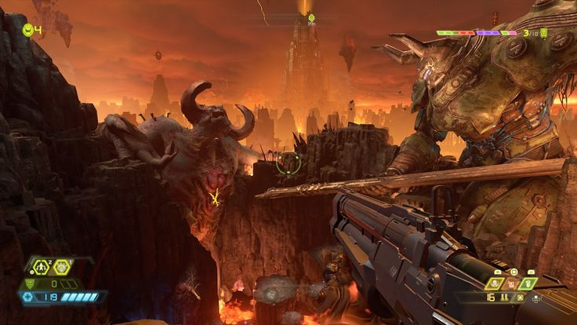

# - Metal Gear Solid V: The Phantom Pain
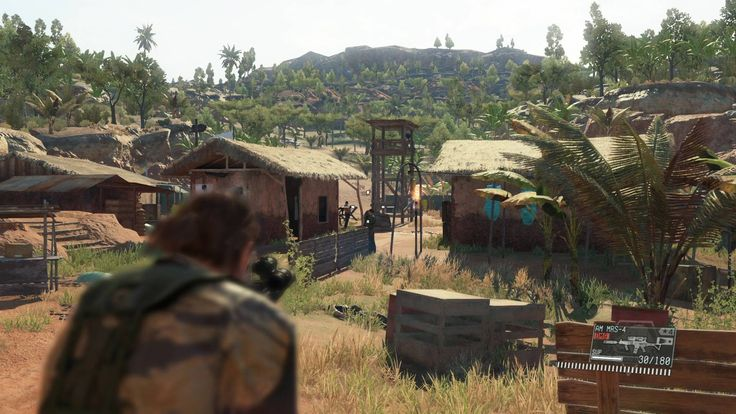

# - Titanfall 2
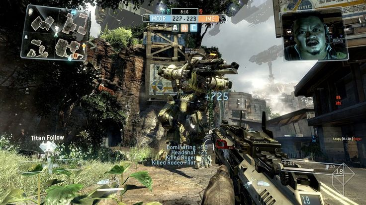

# - Wolfenstein II: The New Colossus
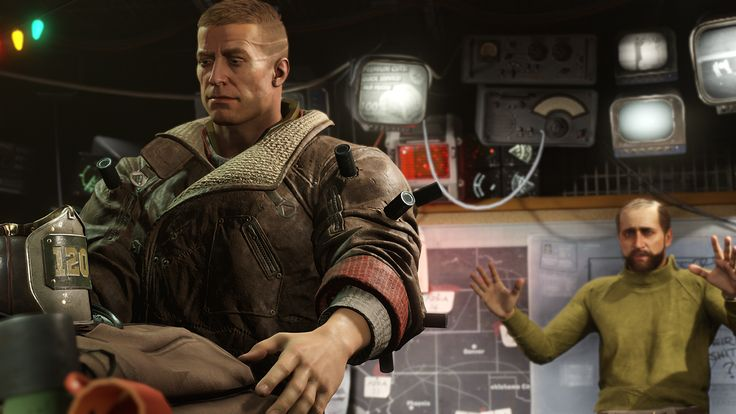

# -Sniper Elite 4
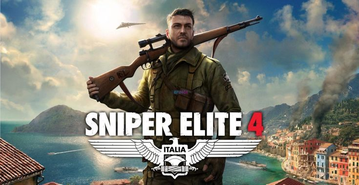

# - Mad Max
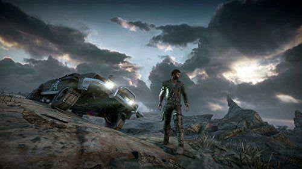

# - Batman: Arkham Knight
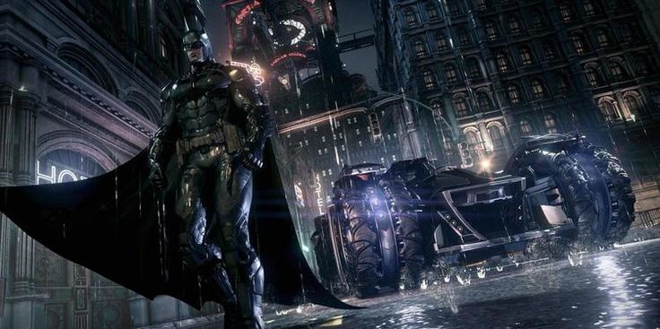

# - Rise of the Tomb Raider
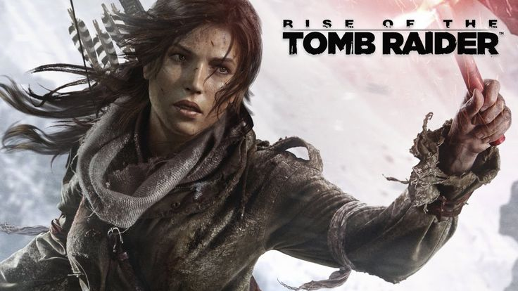

# - Grand Theft Auto V
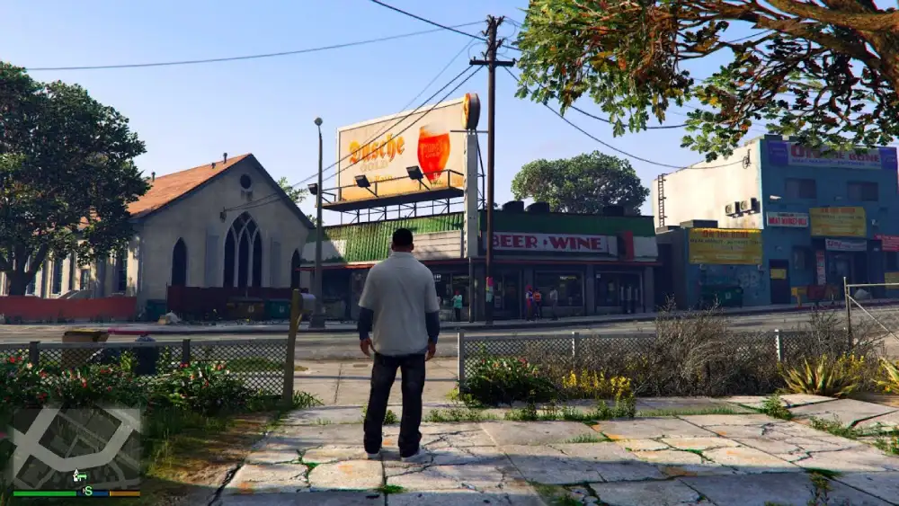

# - Alien: Isolation
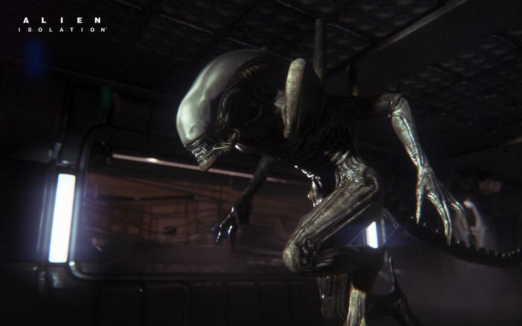

# - Resident Evil 2 (Remake)
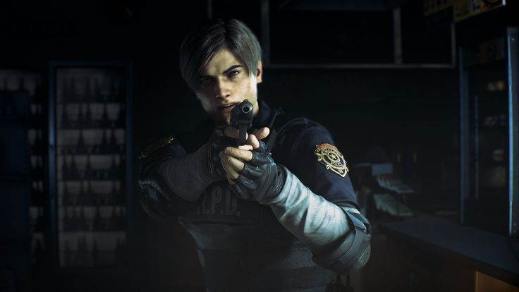

# - Devil May Cry 5
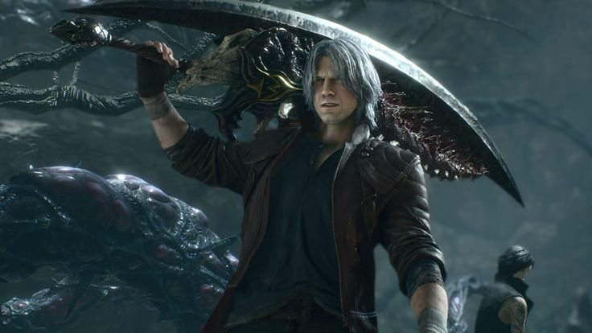

# - BioShock Infinite
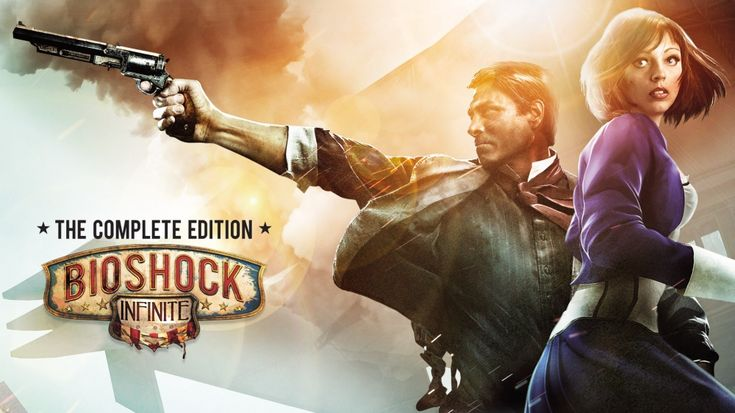

# - Hades
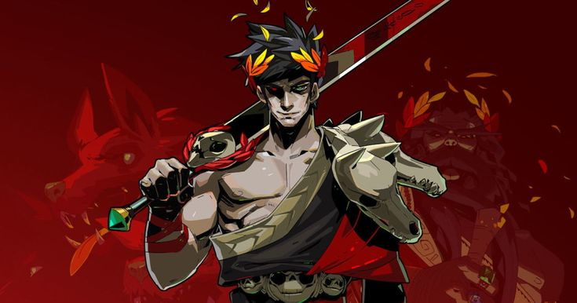

# - Forza Horizon 4
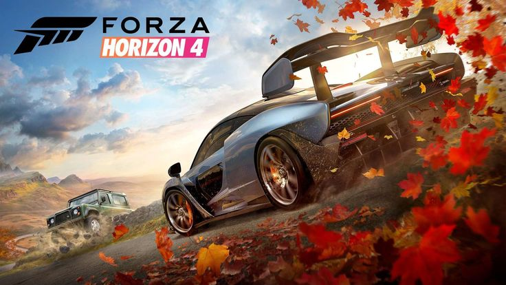

---

## ⚙️ Configuración

| Función | Estado |
|---------|--------|
| Soporte de control en Moonlight | ✅ Funcional |
| Gamepad virtual | ❌ No disponible |
| Gamepad físico | ❌ No disponible |

🌐 **Interfaz web de Sunshine:** `https://[tu-ip-tailscale]:47990`

---

## 💾 Sistema de Respaldos

> Ahorra entre **50% y 75%** del tiempo de espera en tu próxima sesión.

### ¿Cómo funciona?

1. **Descarga e instala** tu juego de Steam/Epic u otra plataforma
2. **Compila los shaders** en el primer inicio (si es necesario)
3. **Realiza un respaldo** una vez que todo esté listo para jugar
4. **¡Listo!** La próxima vez podrás jugar instantáneamente

### 📤 Compartir respaldos entre cuentas de Drive

1. Comparte el enlace de descarga con la cuenta destino
2. Crea un acceso directo al archivo de respaldo en el Drive destino
3. ⚠️ **Importante:** El archivo `backup.tar.gz` no debe estar dentro de ninguna carpeta

---

## ⚠️ Recomendaciones Importantes

- ⏰ Verifica siempre el tiempo restante de uso
- 🔌 Desconéctate cuando no estés usando (el tiempo de 4 horas se reinicia cada 24 horas)
- 👀 No ocultes ni cambies de pestaña de Colab para evitar desconexiones
- 💿 El montaje de Drive es opcional — comenta el código con `#` si no lo necesitas

---

## 🐛 Solución de Problemas

> Si encuentras algún error, simplemente **vuelve a ejecutar el script**.

---

### ⭐ ¡Si te fue útil, no olvides dejar una estrella!

Hecho con ❤️ para la comunidad gamer

